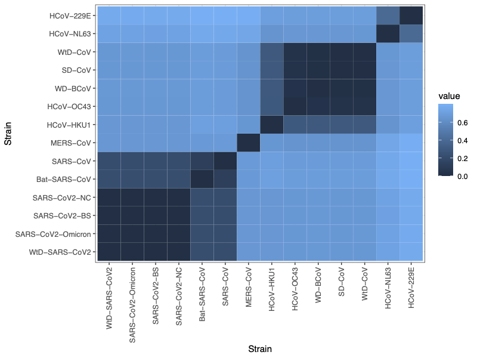
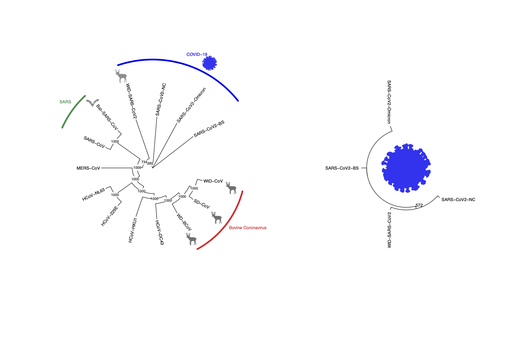

```{r setup, include=FALSE}
knitr::opts_chunk$set(echo = TRUE)
```

#### BIOL 812 Final Project
# Evolutionary Relationships of the Coronaviruses

#### Authors: Casmey, K.\*\, Yoo, G.\*\, Ermakova, G.\*\, and Lounder, H.\*\.
\*\ All authors contributed to the conceptualization, formal analysis, methodology, project administration, visualization, and writing.

##### Project Repository: [https://github.com/gyoo1/BIOL812_FinalProject](https://github.com/gyoo1/BIOL812_FinalProject)

### Background 
In December 2019, numerous cases of an unknown respiratory virus were reported in the city of Wuhan, China. A coronavirus, SARS-CoV-2 was identified as the causative agent for the illness. This virus is closely related to SARS-CoV which was responsible for the SARS outbreak of 2002-2004. A pandemic was declared in March 2020 due to the SARS-CoV-2 virus. 

Even before the COVID-19 pandemic, coronaviruses were a common source of infectious illnesses for a variety of birds and mammals, including humans. Coronaviruses such as NL63, 229E, HKU1, and OC43 cause common colds in humans. In addition, bovine coronaviruses and other related coronavirus strains cause illnesses in animals such as cows and deer, which has had major impacts on both agriculture and wildlife management. 

Therefore, understanding the relationships between coronaviruses, including how they evolve, remain important questions for the management of various illnesses in both humans and other species. In our study, we seek to address the following questions. 

### Questions
1. What is the evolutionary relationship among the human coronavirus strains?

2. What is the evolutionary relationship between the human and animal coronavirus strains?

3. To design a therapy (i.e., mRNA vaccine), which sequence would you target in hopes to carry over immunity between other strains as well? 

***
### Methods
#### Samples

**Table 1.** Coronavirus sequences used in our study.

Number | Accession | Abbreviation | Genome | Organism | Length (bp)
--- | ----- | -------- | -------------- | -------- | -----
1 | OL855841.1 | WtD-SARS-CoV2 | Severe acute respiratory syndrome Coronavirus-2 | White-tailed deer (*Odocoileus virginianus*) | 29831
2 | ON078487.1 | SARS-CoV2-Omicron | Omicron variant; Severe acute respiratory syndrome Coronavirus-2 | Human | 29698
3 | BS001349.1 | SARS-CoV2-BS | Delta variant; Severe acute respiratory syndrome Coronavirus-2 | Human | 29809
4 | NC_045512.2 | SARS-CoV2-NC | Alpha variant; Severe acute respiratory syndrome Coronavirus-2 | Human | 29903
5 | DQ022305.2 | Bat-SARS-CoV | Severe acute respiratory syndrome Coronavirus HKU3-1 | Chinese horseshoe bat (*Rhinolophus sinicus*) | 29728
6 | NC_004718.3 | SARS-CoV | Severe acute respiratory syndrome Coronavirus | Human | 29751
7 | NC_019843.3 | MERS-CoV | Middle East respiratory syndrome Coronavirus | Human | 30119
8 | NC_006577.2 | HCoV-HKU1 | Human Coronavirus HKU1 | Human | 29926
9 | NC_006213.1 | HCoV-OC43 | Human Coronavirus OC43 | Human | 30741
10 | MG518518.1 | WD-BCoV | Water deer Bovine Coronavirus | Water deer (*Hydropotes inermis*) | 31034
11 | FJ425189.1 | SD-CoV | Sambar deer Coronavirus | Sambar deer (*Rusa unicolor*) | 30997
12 | FJ425187.1 | WtD-CoV | White-tailed deer Coronavirus | White-tailed deer (*Odocoileus virginianus*) | 31020
13 | NC_005831.2 | HCoV-NL63 | Human Coronavirus NL63 | Human | 27553
14 | NC_002645.1 | HCoV-229E | Human Coronavirus 229E | Human | 27317

We used whole-genome sequences of 14 coronavirus strains, all publically available from GenBank. Our sample includes 4 strains responsible for the current COVID-19 pandemic (SARS-CoV-2), with the alpha, delta, and omicron strains represented, along with a SARS-CoV-2 strain from white-tailed deer. We also include 2 strains of the SARS-CoV virus, responsible for the SARS epidemic. We use SARS strains from human and Chinese horeshoe bats. We also include 8 other coronavirus sequences, including 1 MERS-CoV (responsible for the MERS epidemic), 4 human coronaviruses (HCoV), and 3 bovine and deer-specific coronaviruses.  
  
#### Workflow

**Figure 1.** An overview of the scripts and inputs used to generate our results.

1. `Read.FASTA.py` reads the downloaded FASTA sequences in the Sequences folder and concatenates them into a single FASTA file (`covseq_concatenated.fasta`).  
2. `DataPrep.R` loads the concatenated FASTA file as a DNAbin file and converts it into a DNAStringSet file (`covseq_DNAStringSet`). A histogram of sequence lengths is generated to check for large gaps in our sampled sequences lengths (`SeqLengths.pdf`). (`DataPrep.R` also includes code for reading and concatenating FASTA files for redundancy.)  
3. The output file `covseq_DNAStringSet` and the script for multiple sequence alignments using MUSCLE `MUSCLE.R` are loaded into the Graham cluster provided by Compute Canada. A bash script for running MUSCLE `Run_MUSCLE.sh` is submitted as a job to the cluster, with the output alignment file saved as `cov_alignment.fasta`  
4. `Dist_Tree.R` generates a distance matrix from the output file using the R package `ape`. Outputs: `DistMatrix.csv`, `DistMatrix.pdf`  
5. `Dist_Tree.R` then creates a neighbour-joining (NJ) tree from the distance matrix. 1000 bootstrap iterations are performed on the NJ tree to assess branch support. Output phylogenies and cladograms are produced using the R package `ggtree`. 
    + Final Figures: `CoV_clado_annotated.pdf`, `CoV_phylo_annotated.pdf`
    + Intermediate Figures: `CoV_cladogram.pdf`, `CoV_cladogram_bs.pdf`, `CoV_phylogram.pdf`  
6. As the relationships between SARS-CoV-2 sequences are poorly resolved due to the high sequence similarity, we ran steps 1-5 again for the 4 SARS-CoV-2 strains in `SARS-CoV-2.R`. The annotated NJ tree with the SARS-CoV-2 sequences only are combined with the full NJ tree to produce the final cladogram: `CoV_cladograms.pdf`  

***
### Results and Interpretations



**Figure 2.** Distance matrix of the 14 coronavirus sequences in our study.


**Figure 3.** Neighbour-joining cladograms for select coronavirus strains. Left tree represents the full set of strains used in our study. Right tree shows the relationships between just the 4 SARS-CoV-2 strains. Numbers represent boostrap values. Significant groups have been labelled: blue for SARS-CoV-2 (causing COVID-19), green for SARS-CoV (causing SARS), and red for bovine coronaviruses. Branch lengths have been removed for simplicity.


**Figure 4.** Neighbour-joining tree for select coronavirus strains. Branch lengths represent the relative amount of sequence divergence, as estimated by a distance matrix. Numbers represent boostrap values. Significant groups have been labelled: blue for SARS-CoV-2 (causing COVID-19), green for SARS-CoV (causing SARS), and red for bovine coronaviruses. 

