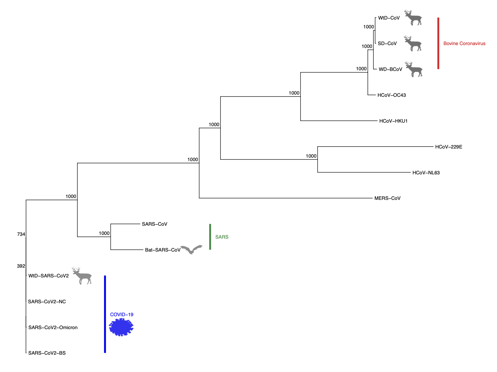

---
output:
  pdf_document: default
  html_document: default
---
```{r setup, include=FALSE}
knitr::opts_chunk$set(echo = TRUE)
```

### BIOL 812 Final Project
# Evolutionary Relationships of the Coronaviruses

### Authors: Casmey, K.\*\, Yoo, G.\*\, Ermakova, G.\*\, and Lounder, H.\*\.\
\*\ All authors contributed to the conceptualization, formal analysis, methodology, project administration, visualization, and writing.

#### Team: Group 2

##### Project Repository: [https://github.com/gyoo1/BIOL812_FinalProject](https://github.com/gyoo1/BIOL812_FinalProject)

##### Data Sources: NCBI GenBank

\newpage

## Background 
In December 2019, numerous cases of an unknown respiratory virus were reported in the city of Wuhan, China [1]. A coronavirus, SARS-CoV-2 was identified as the causative agent for the illness. This virus is closely related to SARS-CoV which was responsible for the SARS outbreak of 2002-2004. A pandemic was declared in March 2020 due to the SARS-CoV-2 virus. 

Even before the COVID-19 pandemic, coronaviruses were a common source of infectious illnesses for a variety of birds and mammals, including humans [2]. Coronaviruses such as NL63, 229E, HKU1, and OC43 cause common colds in humans [3]. In addition, bovine coronaviruses and other related coronavirus strains cause illnesses in animals such as cows and deer, which has had major impacts on both agriculture and wildlife management [4]. 

Therefore, understanding the relationships between coronaviruses, including how they evolve, remain important questions for the management of various illnesses in both humans and other animals. In our study, we aimed to better understand the sequence divergence between different coronavirus strains and whether this could be used to inform disease management (including the development of novel therapies).

## Questions
1. What is the evolutionary relationship between the human and animal coronavirus strains?

2. What is the evolutionary relationship among the human coronavirus strains?

3. To design a therapy (i.e., mRNA vaccine), which sequence would you target in hopes to carry over immunity between other strains as well? 

## Methods
### Samples\

**Table 1.** Coronavirus sequences used in our study.

Number | Accession | Abbreviation | Genome | Organism | Length (bp)
--- | ----- | -------- | -------------- | -------- | -----
1 | OL855841.1 | WtD-SARS-CoV2 | Severe acute respiratory syndrome Coronavirus-2 | White-tailed deer (*Odocoileus virginianus*) | 29831
2 | ON078487.1 | SARS-CoV2-Omicron | Omicron variant; Severe acute respiratory syndrome Coronavirus-2 | Human | 29698
3 | BS001349.1 | SARS-CoV2-BS | Delta variant; Severe acute respiratory syndrome Coronavirus-2 | Human | 29809
4 | NC_045512.2 | SARS-CoV2-NC | Alpha variant; Severe acute respiratory syndrome Coronavirus-2 | Human | 29903
5 | DQ022305.2 | Bat-SARS-CoV | Severe acute respiratory syndrome Coronavirus HKU3-1 | Chinese horseshoe bat (*Rhinolophus sinicus*) | 29728
6 | NC_004718.3 | SARS-CoV | Severe acute respiratory syndrome Coronavirus | Human | 29751
7 | NC_019843.3 | MERS-CoV | Middle East respiratory syndrome Coronavirus | Human | 30119
8 | NC_006577.2 | HCoV-HKU1 | Human Coronavirus HKU1 | Human | 29926
9 | NC_006213.1 | HCoV-OC43 | Human Coronavirus OC43 | Human | 30741
10 | MG518518.1 | WD-BCoV | Water deer Bovine Coronavirus | Water deer (*Hydropotes inermis*) | 31034
11 | FJ425189.1 | SD-CoV | Sambar deer Coronavirus | Sambar deer (*Rusa unicolor*) | 30997
12 | FJ425187.1 | WtD-CoV | White-tailed deer Coronavirus | White-tailed deer (*Odocoileus virginianus*) | 31020
13 | NC_005831.2 | HCoV-NL63 | Human Coronavirus NL63 | Human | 27553
14 | NC_002645.1 | HCoV-229E | Human Coronavirus 229E | Human | 27317

We used whole-genome sequences of 14 coronavirus strains, all publically available from GenBank [5]. Our sample includes 4 strains responsible for the current COVID-19 pandemic (SARS-CoV-2), with the alpha, delta, and omicron strains represented, along with a SARS-CoV-2 strain from white-tailed deer. We also include 2 strains of the SARS-CoV virus, responsible for the SARS epidemic. We use SARS strains from human and Chinese horeshoe bats. We also include 8 other coronavirus sequences, including 1 MERS-CoV (responsible for the MERS epidemic), 4 human coronaviruses (HCoV), and 3 deer-specific coronaviruses (bovine coronaviruses and related strains).  

### Workflow\  
\

**Figure 1.** An overview of the scripts and inputs used to generate our results.

1. `Read.FASTA.py` reads the downloaded FASTA sequences in the Sequences folder and concatenates them into a single FASTA file (`covseq_concatenated.fasta`).  
2. `DataPrep.R` generates a histogram of sequence lengths to check for large gaps in our sampled sequences lengths (`SeqLengths.pdf`). (`DataPrep.R` also includes code for reading and concatenating FASTA files for redundancy.)  
3. The output file `covseq_concatenated.fasta` and the script for multiple sequence alignments using MUSCLE (R package `MUSCLE` [6]) `MUSCLE.R` are loaded into the Graham cluster provided by Compute Canada. A bash script for running MUSCLE `Run_MUSCLE.sh` is submitted as a job to the cluster, with the output alignment file saved as `cov_alignment.fasta`  
4. `Dist_Tree.R` generates a distance matrix from the output file using the R package `ape` [7]. Outputs: `DistMatrix.csv`, `DistMatrix.pdf`  
5. `Dist_Tree.R` then creates a neighbour-joining (NJ) tree from the distance matrix, also using `ape`[7]. 1000 bootstrap iterations are performed on the NJ tree to assess branch support. Output phylogenies and cladograms are produced using the R package `ggtree` [8]. 
    + Final Figures: `CoV_clado_annotated.pdf`, `CoV_phylo_annotated.pdf`
    + Intermediate Figures: `CoV_cladogram.pdf`, `CoV_cladogram_bs.pdf`, `CoV_phylogram.pdf`  
6. As the relationships between SARS-CoV-2 sequences are poorly resolved due to the high sequence similarity, we ran steps 1-5 again for the 4 SARS-CoV-2 strains in `SARS-CoV-2.R`. The annotated NJ tree with the SARS-CoV-2 sequences only are combined with the full NJ tree to produce the final cladogram: `CoV_cladograms.pdf`  

## Results and Interpretations


**Figure 2.** Distance matrix of the 14 coronavirus sequences in our study. Dark colours represent low sequence divergence, while light colours represent high sequence divergence.

***
We observe from our distance matrix that the four SARS-CoV-2 sequences are extremely similar to each other, regardless of the host species (human or white-tailed deer) (Figure 2). This suggests that this white-tailed deer coronavirus is truly SARS-CoV-2, and likely shares a common origin with the human SARS-CoV-2 virus. In addition, the sequence distance between all four strains are extremely small, which is likely because SARS-CoV-2 strains have all undergone rapid divergence within the last 2 years, which has possibly led to very similar overall sequences.

On the other hand, the coronavirus strains from the other deer samples (WD-BCoV, SD-CoV, WtD-CoV) are highly similar to each other, which suggests that all three coronaviruses are, or are related to, bovine coronaviruses.


**Figure 3.** Neighbour-joining cladograms for select coronavirus strains. Left tree represents the full set of strains used in our study. Right tree shows the relationships between just the 4 SARS-CoV-2 strains. Diagrams represent coronnaviruses with non-human hosts (deer species, bat). Numbers at each node represent boostrap values. Significant groups have been labelled: blue for SARS-CoV-2 (causing COVID-19), green for SARS-CoV (causing SARS), and red for bovine coronaviruses.

***
Our neighbour-joining trees help further clarify the distance matrix results. The four SARS-CoV-2 sequences are poorly resolved with low branch support (Figure 3). The branch lengths for SARS-CoV-2 are also extremely short (Figure 4) This may be due to the very similar sequences between the four strains and may reflect the constraints of using a neighbour-joining tree for extremely recent divergences. However, we find that the white-tailed deer SARS-CoV-2 virus is most similar to the SARS-CoV-2-NC virus, which is the original strain of SARS-CoV-2. This may reflect the fact that SARS-CoV-2 was transferred from humans to deer relatively early in the pandemic, before the rise of major variant strains [9].

To address our research question 1, we find that the SARS-CoV-2 sequences are not particularly related to any other coronavirus strains (Figures 3 and 4). This may suggest that SARS-CoV-2 sequences are relatively distinct from previous strains, or may again represent the limitations with our NJ tree approach. Additionally coronaviruses cluster together with strain identity (e.g. MERS-CoV, SARS-CoV) rather than the host species, which supports viral transfers between humans and deer for SARS-CoV-2 and between humans and bats for SARS-CoV.

Interestingly, bovine coronaviruses seem to be most similar to certain human coronavirus strains (e.g. HKU1, OC43) (Figure 3 and 4). Whether this indicates true evolutionary relationship remains to be further explored. 

While the exact relationship between SARS-CoV-2 strains could not be resolved with our NJ trees (research question 2), the low levels of relative distance for the Omicron and Delta SARS-CoV-2 strains may suggest that experimental therapy targetting these strains may be broadly applicable to other coronaviruses as well (research question 3).


**Figure 4.** Neighbour-joining tree for select coronavirus strains. Branch lengths represent the relative amount of sequence divergence, as estimated by a distance matrix. Diagrams represent coronnaviruses with non-human hosts (deer species, bat). Numbers at each node represent boostrap values. Significant groups have been labelled: blue for SARS-CoV-2 (causing COVID-19), green for SARS-CoV (causing SARS), and red for bovine coronaviruses. 


***
## References
1. Fauci, A. S., Lane, H. C., & Redfield, R. R. (2020). Covid-19—navigating the uncharted. New England Journal of Medicine, 382(13), 1268-1269.
2. Wertheim, J. O., Chu, D. K., Peiris, J. S., Kosakovsky Pond, S. L., & Poon, L. L. (2013). A case for the ancient origin of coronaviruses. Journal of Virology, 87(12), 7039-7045.
3. Fehr, A. R., & Perlman, S. (2015). Coronaviruses: an overview of their replication and pathogenesis. Coronaviruses, 1-23.
4. de Mira Fernandes, A., Brandão, P. E., dos Santos Lima, M., de Souza Nunes Martins, M., da Silva, T. G., da Silva Cardoso Pinto, V., ... & Pituco, E. M. (2018). Genetic diversity of BCoV in Brazilian cattle herds. Veterinary medicine and science, 4(3), 183-189.
5. Benson, D. A., Cavanaugh, M., Clark, K., Karsch-Mizrachi, I., Lipman, D. J., Ostell, J., & Sayers, E. W. (2012). GenBank. Nucleic acids research, 41(D1), D36-D42.
6. Edgar RC (2004). “MUSCLE: multiple sequence alignment with high accuracy and high throughput.” Nucleic Acids Res, 32, 1792-1797. doi: 10.1093/nar/gkh340.
7. Paradis E, Schliep K (2019). “ape 5.0: an environment for modern phylogenetics and evolutionary analyses in R.” Bioinformatics, 35, 526-528.
8. Yu G (2020). “Using ggtree to Visualize Data on Tree-Like Structures.” Current Protocols in Bioinformatics, 69(1), e96. doi: 10.1002/cpbi.96, https://currentprotocols.onlinelibrary.wiley.com/doi/abs/10.1002/cpbi.96.
9. Chandler, J. C., Bevins, S. N., Ellis, J. W., Linder, T. J., Tell, R. M., Jenkins-Moore, M., ... & Shriner, S. A. (2021). SARS-CoV-2 exposure in wild white-tailed deer (Odocoileus virginianus). Proceedings of the National Academy of Sciences, 118(47).  


