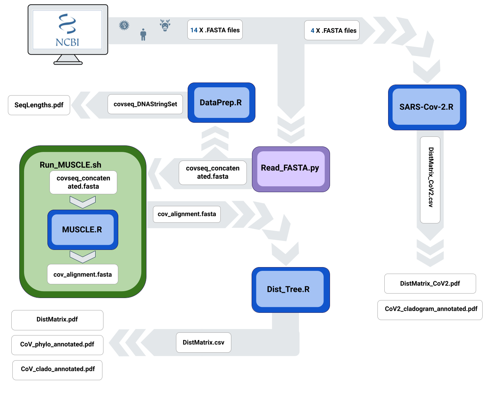

# BIOL812 Final Group Project
## Authors: Gihyun Yoo, Heather Lounder, Kayleigh Casmey, Glafira Ermakova

Assignment prepared for BIOL 812 Introduction to Computational Analysis Winter 2022. In this pipeline, we concatenated DNA sequences (in Python) for 14 Coronavirus variants (Including MERS, SARS and COVID-19) in order to run a MUSCLE multiple sequence alignment (R script ran in Unix). Using this alignment we generated a distance matrix, and phylogeny trees (In R) in order to examine the evolutionary relationship between the different variants. We also repeated these steps (concatenate, MUSCLE, Distance matrix, phylogeny trees) for 4 of the SARS sequences (In R).

# Sequences
 1. Bat_Cov_DQ-022305.fasta : Bat SARS coronavirus HKU3-1, complete genome
    sequence obtained from:     https://www.ncbi.nlm.nih.gov/nuccore/DQ022305.2?report=genbank
    
 2. CoV_WTDeer_OL855841.fasta: white-tailed deer SARS 2 isolate
    sequence obtained from: https://www.ncbi.nlm.nih.gov/nuccore/OL855841.1?report=fasta
    
 3. hCoV_BS001349.fasta: SARS 2 (Japan), complete genome
    sequence obtained from: https://www.ncbi.nlm.nih.gov/nuccore/BS001349
    
 4. hCoV_ON078487.fasta: SARS 2 (South Africa), complete genome 
    sequence obtained from: https://www.ncbi.nlm.nih.gov/nuccore/ON078487
    
 5. HCoV-229E_NC_002645.fasta: Human coronavirus 229E, complete genome
    sequence obtained from: https://www.ncbi.nlm.nih.gov/nuccore/NC_002645
    
 6. HCoV-HKU1_NC_006577.fasta: Human coronavirus HKU1, complete genome
    sequence obtained from: https://www.ncbi.nlm.nih.gov/nuccore/NC_006577
    
 7. HCov-NL63_NC_005831.fasta: Human Coronavirus NL63, complete genome
    sequence obtained from: https://www.ncbi.nlm.nih.gov/nuccore/NC_005831
    
 8. HCov-OC43_NC_006213.fasta: Human coronavirus OC43, complete genome
    sequence obtained from: https://www.ncbi.nlm.nih.gov/nuccore/NC_006213
    
 9. MERS-CoV_NC_019843.fasta: MERS, complete genome
    sequence obtained from: https://www.ncbi.nlm.nih.gov/nuccore/NC_019843
    
10. SambarDeerCov_FJ425189.1.fasta: Sambar deer coronavirus, complete genome
    sequence obtained from: https://www.ncbi.nlm.nih.gov/nuccore/FJ425189.1 
    
11. SARS-CoV_NC_004718.fasta: SARS coronavirus Tor2, complete genome
    sequence obtained from: https://www.ncbi.nlm.nih.gov/nuccore/NC_004718
    
12. SARS-CoV2_NC_045512.fasta: SARS 2 isolate Wuhan-Hu-1, complete genome
    sequence obtained from: https://www.ncbi.nlm.nih.gov/nuccore/NC_045512
    
13. WaterDeer_MG518518.1.fasta: Water deer isolate W17-18, complete genome
    sequence obtained from:https://www.ncbi.nlm.nih.gov/nuccore/MG518518.1 
    
14. White-tailedDeerCov_FJ425187.1.fasta: White-tailed deer, complete genome
    sequence obtained from: https://www.ncbi.nlm.nih.gov/nuccore/FJ425187.1
    
    
# Scripts and their Outputs
1. Read_FASTA.py - converts the 14 fasta sequences from the "sequences"        folder into 1 concatenated file needed for MUSCLE
2. MUSCLE.R - MUSCLE sequence alignment script for the concatenated fasta      file
3. Run_MUSCLE.sh - runs the MUSCLE.R script in commandline to produce an       alignment file "cov_alignment.fasta"
4. Dist_Tree.R - Based on the "cov_alignment.fasta", creates a distance        matrix ("DistMatrix.pdf" and "DistMatrix.csv"), cladogram
   ("CoV_cladogram.pdf"), phylogram ("CoV_phylogram.pdf"), cladogram with      bootstrap values ("CoV_cladogram_bs"), annotated phylogram                  ("CoV_phylo_annotated.pdf"), and annotated cladogram                        ("CoV_clado_annotated.pdf")
5. SARS-Cov-2.R - converts 4 SARS sequences ("CoV_WTDeer_OL855841",            "hCoV_BS001349", "hCoV_ON078487", "SARS-CoV2_NC_045512") into 1             concatenated fasta file ("CoV2_concatenated.fasta"), runs a MUSCLE          alignment ("CoV2_alignment.fasta"), creates distance matrix                 ("DistMatrix_CoV2.pdf", "DistMatrix_CoV2.csv"), and cladogram               ("CoV2_cladogram_annotated.pdf", "Covid_Cladograms.pdf").

# Figures
1. Cov_phylo_annotated.png - Annotated phylogram of 14 sequences
2. Covid_cladograms.png - annotated cladograms of all 14 sequences and 4       SARS sequences
3. DistMatrix.png - Distance Matrix of the 14 strains
4. Pipeline.png - Pipeline of the whole workflow

# Pipeline

