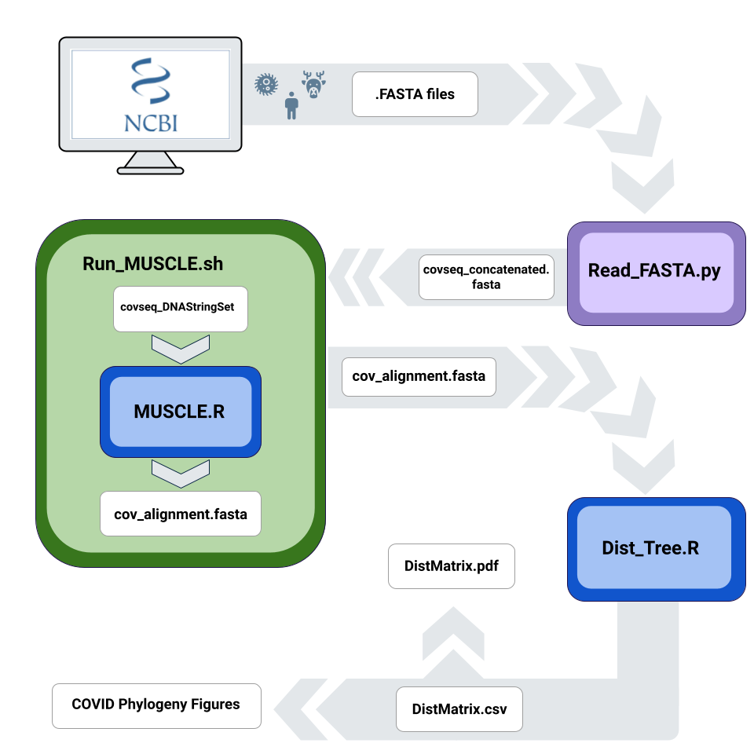

# BIOL812 Final Group Project
## Authors: Gihyun Yoo, Heather Lounder, Kayleigh Casmey, Glafira Ermakova

This is an R Markdown document that generates a github readme.md file.

Assignment prepared for BIOL 812 Introduction to Computational Analysis Winter 2022. In this pipeline, we concatenated the DNA sequences for several Coronavirus variants (Including MERS, SARS and COVID-19) in order to run a MUSCLE multiple sequence alignment. Using this alignment we generated a distance matrix and a phylogeny tree in order to examine the evolutionary relationship between the different variants. 

# Sequences
 1. Bat_Cov_DQ-022305.fasta : Bat SARS coronavirus HKU3-1, complete genome
    sequence obtained from: 
 2. CoV_WTDeer_OL855841.fasta: white-tailed deer SARS 2 isolate
    sequence obtained from:
 3. hCoV_BS001349.fasta: SARS 2 (Japan), complete genome
    sequence obtained from:
 4. hCoV_ON078487.fasta: SARS 2 (South Africa), complete genome 
    sequence obtained from:
 5. HCoV-229E_NC_002645.fasta: Human coronavirus 229E, complete genome
    sequence obtained from:
 6. HCoV-HKU1_NC_006577.fasta: Human coronavirus HKU1, complete genome
    sequence obtained from:
 7. HCov-NL63_NC_005831.fasta: Human Coronavirus NL63, complete genome
    sequence obtained from:
 8. HCov-OC43_NC_006213.fasta: Human coronavirus OC43, complete genome
    sequence obtained from:
 9. MERS-CoV_NC_019843.fasta: MERS, complete genome
    sequence obtained from:
10. SambarDeerCov_FJ425189.1.fasta: Sambar deer coronavirus, complete genome
    sequence obtained from:
11. SARS-CoV_NC_004718.fasta: SARS coronavirus Tor2, complete genome
    sequence obtained from:
12. SARS-CoV2_NC_045512.fasta: SARS 2 isolate Wuhan-Hu-1, complete genome
    sequence obtained from:
13. WaterDeer_MG518518.1.fasta: Water deer isolate W17-18, complete genome
    sequence obtained from:
14. White-tailedDeerCov_FJ425187.1.fasta: White-tailed deer, complete genome
    sequence obtained from:
    
# Scripts
1. Read_FASTA.py - converts the fasta sequences from the "sequences" folder    into 1 concatenated file needed for MUSCLE
2. MUSCLE.R - MUSCLE sequence alignment script for the concatenated fasta      file
3. Run_MUSCLE.sh - runs the MUSCLE.R script in commandline to produce an       alignment file "cov_alignment.fasta"
4. Dist_Tree.R - Based on the "cov_alignment.fasta", creates a distance        matrix ("DistMatrix.pdf" and "DistMatrix.csv"), cladogram
   ("CoV_cladogram.pdf"), phylogram ("CoV_phylogram.pdf"), cladogram with      bootstrap values ("CoV_cladogram_bs"), annotated phylogram                  ("CoV_phylo_annotated.pdf"), and annotated cladogram                        ("CoV_clado_annotated.pdf")

5. Cov 2

# Output

